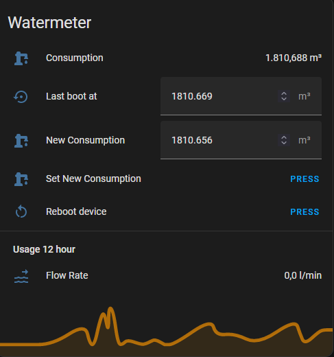

# Water meter sensor
Water meter with LJ12A3-4-Z/BX 5V inductive proximity sensor designed for and depending on Home Assistant

Community accountability

<i>As I started with a water meter sensor for Home Assistant, I wanted an ESPHome device that shows the real water meter reading exactly. Since my knowledge of ESPHome is not yet to be called extensive, I searched around. No solution fitted my idea completely, so I assembled the code that you will find here from numerous samples and added some of my own. Thx all for sharing!</i>

## Hardware
+ Wemos D1 mini (or probably any other ESP8266)
+ LJ12A3-4-Z/BX 5V inductive proximity sensor (5V only!)
+ Some contraption to mount the sensor firmly on top of the the water meter, e.g. my 3D printed water meter mount

Only water meters with a rotating wheel with metal plate are suitable. You have to mount the proximity sensor right above this wheel but a bit eccentric. If the sensor has power, the red light on top of it should turn on and off when the wheel is rotating (i.e. water is used).

### Exposed entities
+ Sensors: `Consumption`, `Flow Rate`
+ Configuration: `Restart`
+ Diagnostic: `IP address`, `Uptime`
+ Services: `restore`, `set`

### Concept
The value of `Consumption` should represent the real water meter reading as precisely as possible, even after reboots or power failures. `Consumption` should also be easily adjustable from the Home Assistant UI. To establish both, the ESPHome code relies on three automations, two input_numbers and one input_button in Home Assistant. Two automations and one input_number to preserve `Consumption` during reboots, one input_number and input_button to adjust `Consumption`.

### Setup
***It's best to let the watermeter have a constant value during setup, so try not to use water while setting it all up.***

+ Connect the proximity sensor to the 5V, GND and GPIO0 pins of the ESP8266. Change the ESPHome code if you use another GPIO pin.
+ Power up the ESP, upload the ESPHome code and wait until it's online again.
+ Add the discovered device `watermeter` to Home Assistant.
+ Add the necessary automations and helpers to Home Assistant.
+ Add the entities card to Home Assistant.
+ Set `New Consumption` to the real water meter reading, press `Set New Consumption` and use some water to confirm.
+ Press `Reboot device` and use some water to confirm.

**TO DO:** _'Consumption' has the correct value but is shown as_ `unknown` _right after boot, some water use is necessary to get the first reading. However, if things are up and running this is not a real problem anymore. Haven't sorted this out yet, ideas are welcome!_

### Energy Dashboard
As soon as the sensor comes online for the first time, Home Assistant will start collecting statistics. After five minutes the first short term statistic is calculated. Energy Dashboard uses these values but because the first value of `Consumption` probably will not be the correct meter reading, Energy Dashboard starts on the wrong foot. It could report a very large water consumption for the first hour. I have found no way to correct that in Home Assistant. But this seems to work (point being that the sensor has to have the correct value when it appears for the first time in Home Assistant):

1. Restart Home Assistant before you add (configure) the integration for this device.
2. Do the setup as described above. Make sure `Consumption` is the same as the real water meter reading and do no use water yet.
3. Remove the device from Home Assistant, wait a minute and restart Home Assistant.
4. Search under _Settings_ => _Devices & Services_ => _Entities_ for `watermeter` and confirm all device related entities are gone (helpers and automations are still there).
5. Search under _Developer Tools_ => _Statistics_ for `watermeter` and confirm all device related entities are gone[^nerd_level].
6. Add the device intergration to Home Assistant once again.
7. Add `sensor.watermeter_consumption` as a water source to the Energy Dashboard. It can take a few minutes before the first statistics arrive.
8. Energy Dashboard should now report correct water consumption.

Another way could be creating a template sensor following the state of `Consumption` (not tried) and use this as water source for Energy Dashboard. Or you could change the id of `sensor.watermeter_consumption` (not tried, requires changing references to `sensor.watermeter_consumption` too).

### Usage
The mechanism to retain `Consumption` across reboots or power failures will not work if the device is not active and water is used during this time. After a while `Consumption` could be lagging. Check the real meter reading once in a while and correct `Consumption` if necessary.

[^nerd_level]: If these values are not gone ***AND you're very familiar with editing the Home Assistant database*** you could delete the corresponding rows from tables `statistics_meta` (find the `metadata_id`'s here), `statistics` and `statistics_short_term` (use the `metadata_id`'s for these two tables to find the rows). ***IMPORTANT NOTE: Shutdown Home Assistant gracefully and backup the database before editing!***
